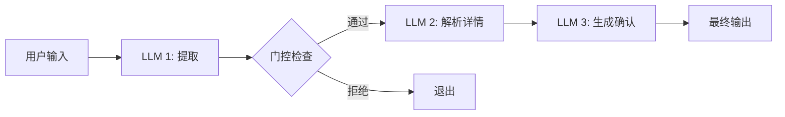
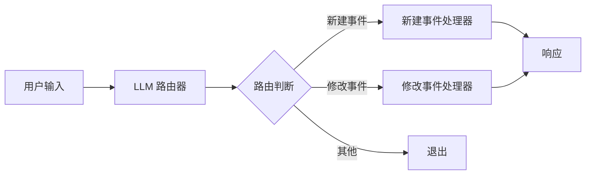
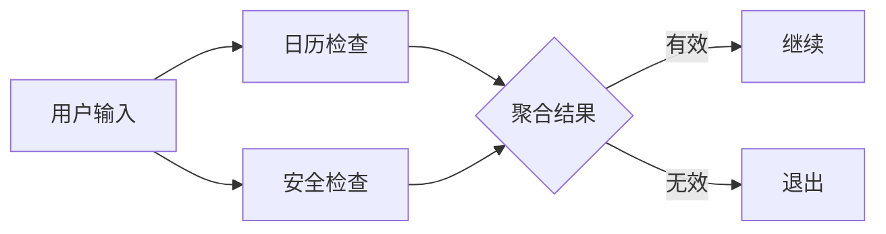

# 纯Python构建高效LLM工作流指南

本仓库包含构建高效LLM驱动系统的实用模式与范例。这些模式基于真实场景的实践经验及生产系统总结的教训，注重简洁性与可组合性而非复杂框架。

无论您正在构建自主智能体还是结构化工作流，这里都能找到只需几行代码即可实现的成熟模式。每种模式都配有实用示例和示意图，帮助您理解其适用场景及有效应用方法。

深入了解这些模式背后的理论与实践：
- [构建高效智能体](https://www.anthropic.com/research/building-effective-agents) - Anthropic技术博客
- [实用LLM模式视频指南](https://youtu.be/tx5OapbK-8A) - Dave Ebbelaar主讲的核心概念视频教程

## 内容目录

本教程将涵盖纯Python构建AI智能体所需的全套知识。我们将从基础构建模块开始，逐步深入构建可靠系统的工作流模式。学习前建议掌握基础Python技能，熟悉OpenAI SDK并准备API密钥。强烈建议克隆GitHub仓库以便逐步实践代码。建议先观看我的演示，再自行实践以巩固理解。45分钟的课程节奏较快，您可随时暂停、回放或向ChatGPT寻求帮助。

第一部分：基础构建模块：增强型LLM

- 基础LLM调用
- 结构化输出
- 工具调用
- 检索增强

第二部分：构建AI系统的工作流模式

- 提示链
- 路由分发
- 并行处理

## 工作流模式

### 提示链 (Prompt Chaining)

提示链是一种强大模式，将复杂AI任务分解为一系列更小、更专注的步骤。链中的每个步骤处理前一步的输出，从而实现更好的控制、验证和可靠性。

#### 日历助手示例

我们的日历助手展示了带验证的三步提示链：

#### 第一步：提取与验证

- 判断输入是否为有效日历请求
- 提供置信度评分
- 作为初始过滤器防止处理无效请求

#### 第二步：解析详情

- 提取具体日历信息
- 结构化数据（日期、时间、参与者等）
- 将自然语言转换为结构化数据

#### 第三步：生成确认

- 创建用户友好的确认消息
- 可选生成日历链接
- 提供最终用户响应

### 路由分发 (Routing)

路由分发是一种将不同类型请求导向专门处理器的模式。这可以在保持关注点分离的同时，实现对不同请求类型的优化处理。

#### 日历助手示例

我们的日历助手展示了新建事件与修改事件之间的路由分发：

#### 路由器

- 分类请求类型（新建/修改事件）
- 提供置信度评分
- 清理和标准化输入

#### 专用处理器

- 新建事件处理器：创建日历事件
- 修改事件处理器：更新现有事件
- 每个处理器针对特定任务优化

### 并行处理 (Parallelization)

并行处理通过同时运行多个LLM调用来验证或分析请求的不同方面。

#### 日历助手示例

我们的日历助手实现了并行验证保障机制：

#### 并行检查

- 日历验证：确认有效日历请求
- 安全检查：筛查提示注入攻击
- 同时运行以提高性能

#### 结果聚合

- 组合验证结果
- 应用验证规则
- 做出最终接受/拒绝决策

### 协调器-工作器模式 (Orchestrator-Workers)

协调器-工作器模式使用核心LLM动态分析任务、协调专业化工作器并合成结果。这创建了一个能适应不同类型请求同时保持专业化处理的灵活系统。

#### 博客写作示例

我们的博客写作系统展示了用于内容创作的协调器模式：

#### 协调器

- 分析博客主题与需求
- 创建结构化内容计划
- 协调章节撰写
- 管理内容流与连贯性

#### 规划阶段

- 分析主题复杂度
- 识别目标受众
- 将内容分解为逻辑章节
- 分配每章节字数
- 定义写作风格指南

#### 写作阶段

- 专业化工作器撰写独立章节
- 每个章节保持与前文的上下文关联
- 遵循风格与长度指南
- 捕捉每章节关键点

#### 评审阶段

- 评估整体连贯性
- 评分内容流畅度（0-1分）
- 提出章节级改进建议
- 生成最终润色版本
